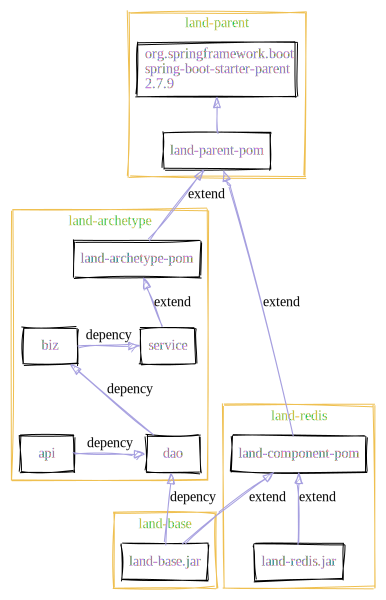

# Table of Contents

1.  [Introduction](#org16384f7)
2.  [context](#org5aadedd)
3.  [build](#org63d887e)
4.  [generate](#orgd229d49)
5.  [git submodule](#orgc38acc9)
6.  [referene](#org805dc73)

# Introduction

Land Microservices Archetype , A standard Java framework for quick projects for teams and companies.  

# context

  

# build

    sh ./land.template/build-archetype.sh

# generate

    mvn archetype:generate -DarchetypeGroupId=com.land.archetype \
    -DarchetypeArtifactId=pom-archetype -DarchetypeVersion=0.0.1-SNAPSHOT \
    -DinteractiveMode=false -DgroupId=com.land.center -DartifactId=land.crm \
    -Dversion=0.1.0-SNAPSHOT -Dpackage=com.land.crm \

# git submodule

    # 添加一个子模块项目
    git submodule add git@github.com:vanniuner/land-archetype.git
    # 克隆项目并自动刷拉取所有子模块
    git clone --recurse-submodules git@github.com:vanniuner/land-parent.git
    # 更新 所有 子模块
    git submodule update --remote

# referene

<https://www.baeldung.com/maven-relativepath>  

